# Lello: Diário Gamificado de Autocuidado para Android

**Lello** é um projeto de TCC do curso de Engenharia de Software, desenvolvido como um aplicativo Android nativo e modular. O objetivo é oferecer uma ferramenta de suporte para pessoas em tratamento psicológico e psiquiátrico, transformando a jornada de autocuidado em uma experiência mais leve, divertida e engajadora.

Inspirado na simbologia da **Casa Amarela de Van Gogh** e na campanha do **Setembro Amarelo**, o aplicativo foi concebido para ser um espaço seguro e acolhedor. Nele, o usuário pode registrar suas emoções, hábitos e rotinas, fortalecendo o autoconhecimento e a adesão ao tratamento.

<table align="center">
  <tr>
    <td align="center">
      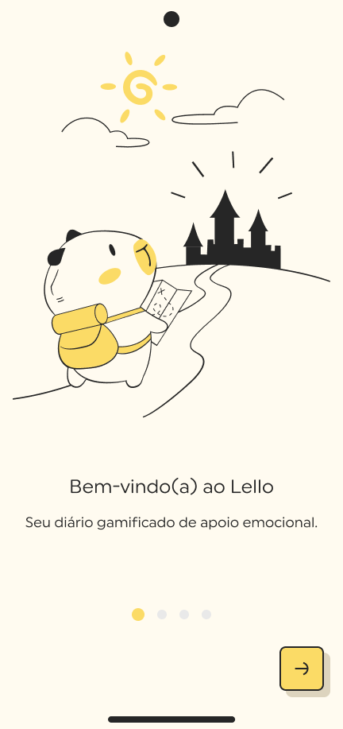
    </td>
    <td align="center">
      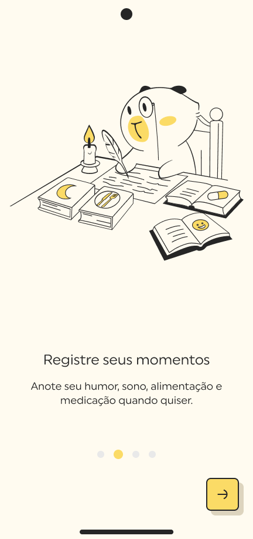
    </td>
    <td align="center">
      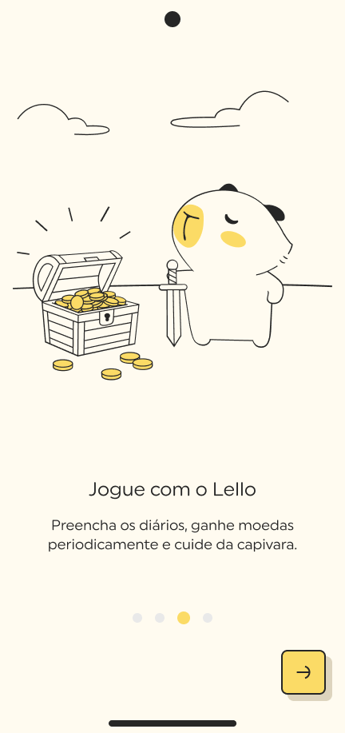
    </td>
    <td align="center">
      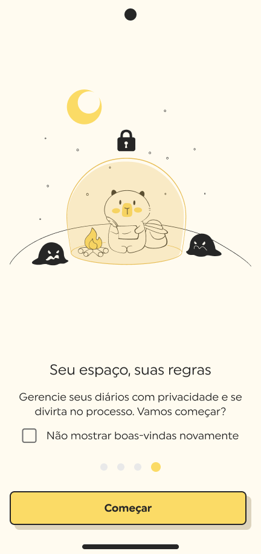
    </td>
        <td align="center">
      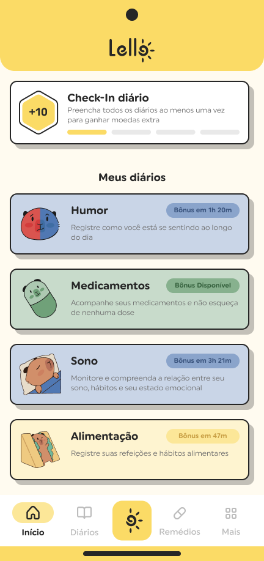
    </td>
  </tr>
</table>

## 🌟 Visão Geral do Aplicativo

O Lello utiliza a gamificação para incentivar o registro contínuo e a disciplina. O usuário é acompanhado pela **Lello, uma capivara de estimação**, que evolui e recebe itens conforme o progresso nas atividades de autocuidado.

A cada registro nos diários, o usuário ganha moedas e recompensas, que podem ser trocadas por itens para personalizar sua mascote, tornando o processo de acompanhamento terapêutico mais dinâmico e recompensador.

<table align="center">
  <tr>
    <td align="center">
      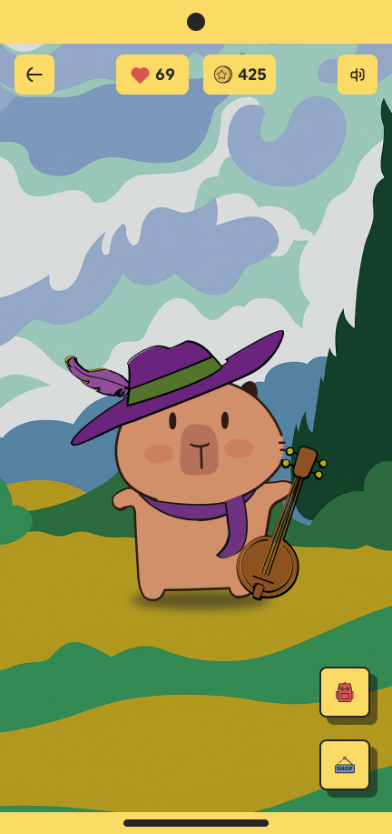
    </td>
    <td align="center">
      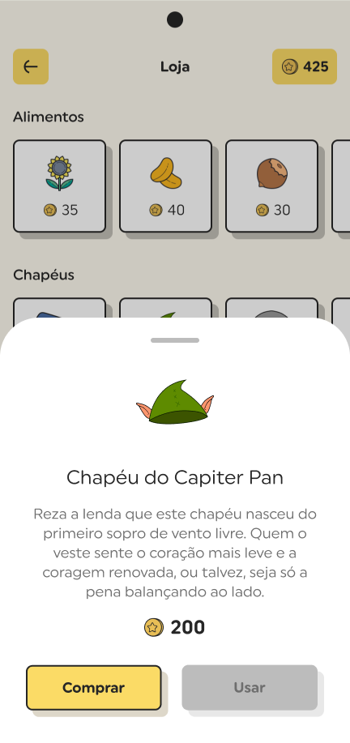
    </td>
  </tr>
</table>

## ✨ Funcionalidades Principais

As funcionalidades foram baseadas no livro "Treinamento de Habilidades em DBT" de Marsha M. Linehan, focando em quatro diários principais:

-   **Diário de Humor:** Permite ao usuário registrar suas emoções, identificar gatilhos e compreender melhor seu estado emocional ao longo do dia.
-   **Diário de Sono:** Monitora a qualidade e a duração do sono, ajudando a identificar padrões que impactam o bem-estar.
-   **Diário de Alimentação:** Auxilia no registro de hábitos alimentares e na percepção de como a alimentação afeta o humor e a energia.
-   **Diário de Medicamentos:** Facilita o acompanhamento da adesão ao tratamento, com lembretes e espaço para registrar efeitos colaterais.

<table align="center">
  <tr>
    <td align="center">
      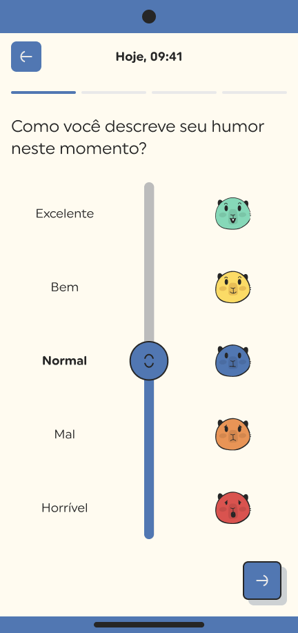
    </td>
        <td align="center">
      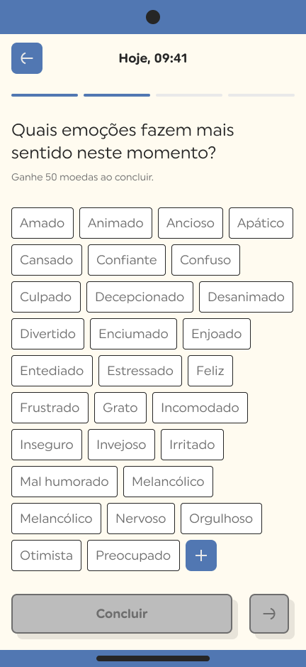
    </td>
    </td>
        <td align="center">
      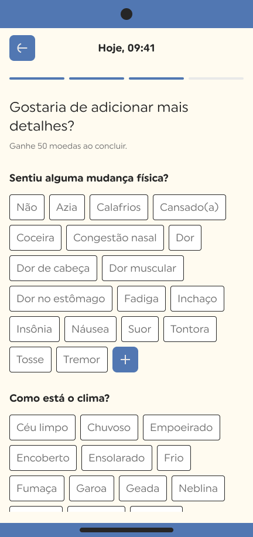
    </td>
    </td>
        <td align="center">
      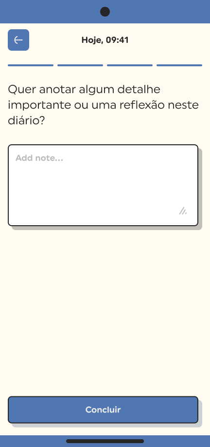
    </td>
    </td>
        <td align="center">
      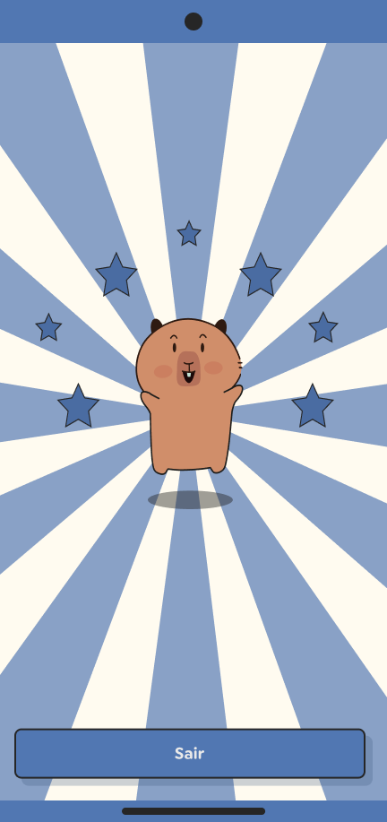
    </td>  
  </tr>
</table>

## 🛠️ Arquitetura e Tecnologias

O Lello foi projetado com foco em boas práticas de desenvolvimento e uma arquitetura escalável, inspirada em projetos de referência como o [Now in Android](https://github.com/android/nowinandroid).

-   **Arquitetura Modular:** O projeto é dividido em módulos independentes (`app`, `core`, `features`), garantindo baixo acoplamento, testabilidade e manutenibilidade.
-   **Clean Architecture & MVVM:** A estrutura segue os princípios da Clean Architecture, com uma separação clara de responsabilidades entre as camadas de UI, domínio e dados, utilizando o padrão MVVM.
-   **100% Kotlin & Jetpack Compose:** A interface é construída de forma declarativa com o Jetpack Compose, e todo o código é escrito em Kotlin.
-   **Injeção de Dependências com Dagger Hilt:** Para gerenciar as dependências de forma robusta e escalável.
-   **Persistência de Dados com Room:** Os dados são armazenados localmente no dispositivo usando o banco de dados SQLite através da biblioteca Room.
-   **Firebase:** Utilização de serviços como Firebase Authentication, Analytics e Crashlytics.
-   **Gerenciamento de Dependências:** Uso do `libs.versions.toml` para um controle centralizado e organizado das bibliotecas.

## 📚 Documentação e Protótipo

-   **[Documentação Técnica]([https://link-para-sua-documentacao.com](https://docs.google.com/document/d/1VX06Tmg64IOdRQsGVi1NcmZzmNdOQ3sQXTSLNWhziWs/edit?usp=sharing))** *(Substitua pelo link do seu documento)*
-   **[Protótipo no Figma]([https://link-para-seu-figma.com](https://www.figma.com/design/PXDYBv1gR2Vp49vuCRUqHa/Lello?node-id=1-964&t=FF7y1C2sVSNB8cZi-1))** *(Substitua pelo link do seu protótipo)*

## 🎨 Design e Créditos

Todo o conceito visual, as ilustrações e a identidade do aplicativo foram criados em conjunto com a incrível designer **[Julia Della Nora](https://www.linkedin.com/in/jdn91/)**. De todo meu :heart:, muito obrigado!
